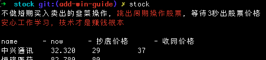

## 股票告警分析工具

实现博客：https://blog.csdn.net/luo4105/article/details/89257924

### 为什么要做

1. 每次想看股票的时候都要拿出手机，或者打开股票软件，这个过程一般都比较长，很容易打断连贯的代码思路，并且股票软件都有太多广告信息，诱惑信息，让人忍不住去点，浪费很长时间，同时也杂多的信息，容易让人陷入FOLO的心态，活生生成了韭菜。
2. 需要一个告警通知，某某股票到了我设定的告警值，我可以加仓或者斩仓了。（最重要）
3. 可以不留痕迹有迅速的查看股票。

支持功能

1. 查看实时自选股票价格
2. 股票阀值告警

> 目前支持macOS/win两种系统

### 实现效果

#### 实时自选股票价格

终端输入指定命令：stock

终端显示自选股票信息

```
name      - now      - max_today      - min_today
中兴       - 32.14    - 33.41         32
```

命令后可接参数`income`，如`stock income`，则可以输出设置的买入价格和目前收益。

```
name      - now      - max_today      - min_today   - buy_price   - income
中兴       - 32.14    - 33.41         32              28.40         1200
```

**实际效果**



#### 阀值告警

当股票价格高于设定阀值，调用mac系统通知。


### 安装使用教程

[mac版本](doc/guide-mac.md)

[win版本](doc/guide-win.md)


